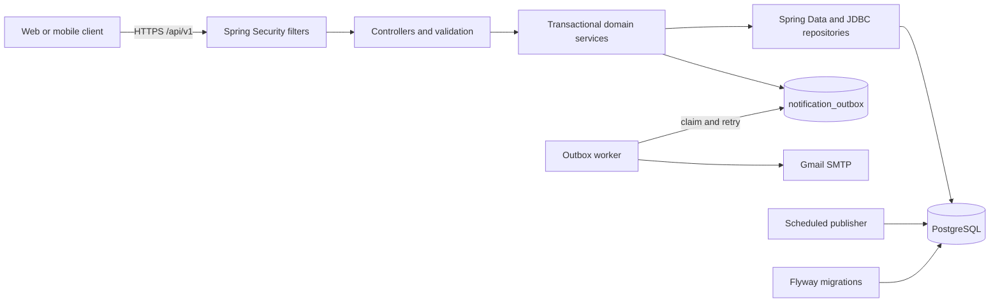
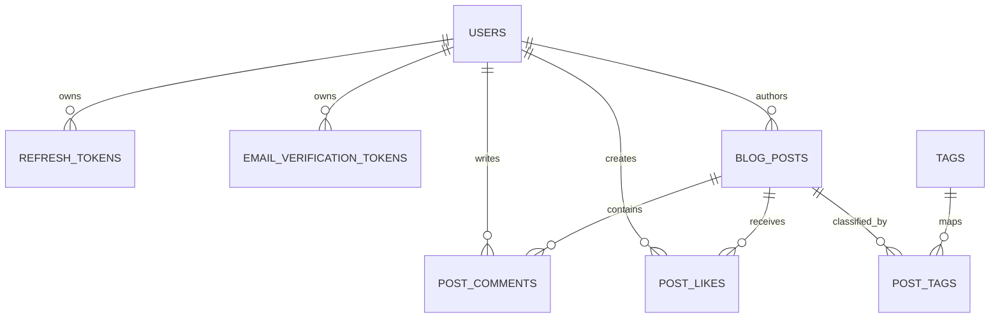

# Byteblog

Byteblog is a production-oriented Spring Boot modular monolith for technical publishing. It provides versioned REST APIs, UUID identifiers, JWT authentication with rotating refresh-token families, PostgreSQL full-text search, tags, scheduled publishing, comments, likes, moderation, durable HTML-email delivery, health probes, and automated security-focused CI.

- API documentation: [docs/API-endpoints.md](docs/API-endpoints.md)
- Configuration and runbook: [docs/Readmd.md](docs/Readmd.md)
- Swagger UI when running: [http://localhost:8080/swagger-ui.html](http://localhost:8080/swagger-ui.html)
- OpenAPI JSON when running: [http://localhost:8080/v3/api-docs](http://localhost:8080/v3/api-docs)

## Architecture



The application stays a modular monolith. Domain changes and notification records share one database transaction, while email delivery and scheduled publishing run as restart-safe background workers.

## Database overview



PostgreSQL also stores authentication rate-limit windows and the durable notification outbox. Public post search uses a generated weighted `tsvector` and a GIN index.

## Security design

- Access tokens are signed JWTs with startup validation for key length and expiration.
- Refresh tokens use 256 random bits and only their SHA-256 hashes are stored.
- Every refresh rotates the token, revokes the predecessor, and keeps the token family.
- Reuse of a revoked token marks replay and revokes the entire family.
- Refresh is rejected for inactive or unverified accounts.
- Password and email changes revoke all outstanding refresh tokens.
- Login, registration, refresh, and verification use PostgreSQL-backed per-client rate limits that work across application instances.
- New passwords require 12–100 characters and are stored with BCrypt.
- Author and admin operations enforce ownership/role checks in the service layer.
- Errors do not expose stack traces or internal exception details.
- CORS accepts only configured origins.

The V4 migration intentionally invalidates existing development refresh tokens because legacy values were stored in raw form. Users must log in again after upgrading.

## Reliability and data integrity

- Flyway owns the schema; Hibernate runs in `validate` mode.
- Post likes use `INSERT ... ON CONFLICT DO NOTHING` for database-backed idempotency.
- Same-title slug allocation uses a transaction-scoped PostgreSQL advisory lock plus a unique constraint.
- Posts use optimistic locking with a `version` field; stale edits return `409 Conflict`.
- Public post pages obtain metrics in a projected query and tags in one batched query, avoiding per-post count queries.
- Scheduled publication uses locked batches with `FOR UPDATE SKIP LOCKED`.
- Email outbox workers claim rows with `FOR UPDATE SKIP LOCKED`, recover stale claims, and retry failures with exponential backoff.
- HTML email templates live under `src/main/resources/templates/email` and values are HTML escaped.

SMTP cannot provide exactly-once delivery: a process failure after Gmail accepts a message but before the outbox row is marked sent can produce a duplicate. The stable outbox record and idempotency key make this observable; a provider supporting idempotency keys would close that final gap.

## Quick start

Create local configuration and replace the example database password and JWT secret:

```bash
cp .env.example .env
docker compose --env-file .env up --build -d
```

Check health and OpenAPI:

```bash
docker compose --env-file .env ps
curl http://localhost:8080/actuator/health/readiness
curl http://localhost:8080/v3/api-docs
```

Stop without deleting data:

```bash
docker compose --env-file .env down
```

Run only PostgreSQL:

```bash
docker compose --env-file .env -f docker-compose.db.yml up -d
```

## API examples

Register with a password of at least 12 characters:

```bash
curl --request POST http://localhost:8080/api/v1/auth/register \
  --header 'Content-Type: application/json' \
  --data '{
    "name": "Paranietharan",
    "email": "parani@example.com",
    "password": "correct-horse-battery-staple"
  }'
```

Create a tagged scheduled post:

```bash
curl --request POST http://localhost:8080/api/v1/posts \
  --header 'Authorization: Bearer ACCESS_TOKEN' \
  --header 'Content-Type: application/json' \
  --data '{
    "title": "PostgreSQL search in Spring Boot",
    "excerpt": "Weighted full-text search with a GIN index",
    "content": "# Introduction\n\nPost content...",
    "status": "DRAFT",
    "scheduledPublishAt": "2026-08-20T09:00:00",
    "tags": ["Spring Boot", "PostgreSQL"]
  }'
```

Search published posts:

```bash
curl 'http://localhost:8080/api/v1/posts?query=postgresql+search&tag=postgresql&page=0&size=20'
```

Refresh tokens are single-use:

```bash
curl --request POST http://localhost:8080/api/v1/auth/refresh-token \
  --header 'Content-Type: application/json' \
  --data '{"refreshToken":"CURRENT_REFRESH_TOKEN"}'
```

Store the new refresh token from the response immediately. Reusing the previous value revokes the complete token family.

## Testing

Start PostgreSQL and run all tests:

```bash
docker compose --env-file .env -f docker-compose.db.yml up -d
./mvnw clean test
```

The suite includes service tests for permissions and notifications, refresh rotation/replay tests, application-context migration validation, and a query-count integration test that prevents reintroducing the public-post N+1 pattern.

Build the production image:

```bash
docker compose --env-file .env build api
```

## CI

`.github/workflows/ci.yml` runs:

1. PostgreSQL-backed Maven tests and packaging.
2. Pull-request dependency review for high-severity vulnerabilities.
3. A cached production Docker build.
4. Trivy scanning for high and critical image vulnerabilities.
5. SARIF upload to GitHub code scanning.

Dependabot checks Maven, GitHub Actions, and Docker dependencies weekly.

## Design decisions and trade-offs

- **Modular monolith:** transaction boundaries, deployment, debugging, and local development remain simple. Modules can be extracted only if scale or team ownership requires it.
- **Opaque rotating refresh tokens:** server-side revocation and replay detection are stronger than long-lived stateless refresh JWTs, at the cost of one database lookup per refresh.
- **Database-backed rate limits:** consistent across instances without another service, at the cost of database writes on protected authentication routes. A very high-scale deployment could move these buckets to Redis.
- **Transactional outbox:** prevents notification loss between commit and scheduling, at the cost of eventual rather than immediate delivery and operational outbox monitoring.
- **PostgreSQL full-text search:** fast, ranked/indexed search without external infrastructure. Elasticsearch/OpenSearch is unnecessary until search requirements outgrow PostgreSQL.
- **Scheduled publishing:** runs in-process but coordinates through row locks, so multiple application instances remain safe.

## Production deployment

Run the API image behind TLS and connect it to private managed PostgreSQL such as Amazon RDS. Put `DB_PASSWORD`, `JWT_SECRET`, and `MAIL_APP_PASSWORD` in a secret manager. Use an SSL JDBC URL such as:

```dotenv
DB_URL=jdbc:postgresql://your-rds-endpoint:5432/byteblog?sslmode=require
APP_API_BASE_URL=https://api.example.com
APP_FRONTEND_BASE_URL=https://example.com
CORS_ALLOWED_ORIGINS=https://example.com
```

Do not deploy the local PostgreSQL Compose service as the production database.
